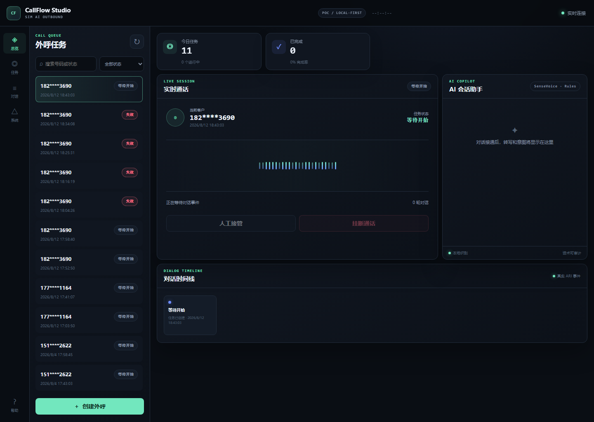

# 手机 SIM 智能外呼系统

这是一套使用 Android 手机 SIM 卡拨打真实电话的外呼验证系统。Java 服务通过 Asterisk ARI 控制拨号、播放预录话术和分段录音，SenseVoiceSmall 在本地完成语音识别，再由可审计的规则进行意图判断和对话分支。

> 当前定位是技术验证版（PoC），不应未经合规评审直接用于生产批量外呼。



## CallFlow Studio 工作台

新版页面采用面向运营人员的深色外呼工作台布局，并直接读取现有任务、ARI 事件与对话轮次接口：

- 左侧任务队列支持号码/状态搜索、状态筛选和手机号脱敏。
- 顶部指标展示任务量、完成率、人工跟进和失败数，不使用前端演示数据。
- 实时通话区同步当前状态、对话节点和轮次；AI 助手展示 SenseVoice 转写、规则意图与置信度。
- 对话时间线展示真实状态事件；SSE 中断后采用有上限的退避重连。
- 创建外呼必须输入有效手机号并明确确认授权；人工接管和挂断在后端提供安全 API 前保持禁用。

## 已完成能力

- 使用手机 SIM 卡自动拨打真实号码。
- 通过 Asterisk ARI 控制接通、播放、录音和挂断。
- 按固定流程播放预录话术，避免模型自由生成不可控话术。
- 分段收集客户回答，并保存录音、转写和判断结果。
- 使用本地 SenseVoiceSmall + VAD 识别中文回答。
- 识别本人/非本人、同意/拒绝家访、有效联系时间等意图。
- 每轮回答后播放过渡语；回答不清时追问一次，仍不清则标记人工跟进。
- Web 页面创建单号码任务、明确勾选拨打授权，并查看实时状态与对话轮次。
- 保留规则判断、GPT 判断和失败回退接口，默认引导流程使用固定规则。

## 当前对话流程

1. 播放开场白并确认是否本人。
2. 播放“好的，请稍候”，识别客户回答。
3. 本人则进入家访配合确认；非本人则保护信息并结束。
4. 询问是否配合家访，根据同意、拒绝或不清楚进入对应分支。
5. 询问方便联系的时间，保存回答后播放结束语。
6. 将完整转写、结构化意图与人工跟进标记保存到任务。

## 系统架构

```text
Web 测试页 / REST API
          |
Spring Boot 对话状态机
          | ARI (HTTP + WebSocket)
       Asterisk
          | chan_mobile + USB 蓝牙
      Android 手机 + SIM
          |
       运营商网络

录音 -> SenseVoiceSmall/VAD -> 规则意图判断 -> 下一段预录话术
```

## 仓库结构

```text
src/                    Spring Boot 业务与前端测试页
speech-service/         SenseVoiceSmall 本地转写 API
infra/asterisk/         Docker SIP 测试配置
infra/asterisk-wsl/     WSL2 + chan_mobile 真实 SIM 配置模板
scripts/                WSL Asterisk 安装与健康检查脚本
prompts/                8 kHz 单声道预录话术
docs/                   部署、测试、设计与实施记录
```

## 快速安全体验（不拨打真人电话）

需要 JDK 17 和 Maven 3.9+：

```powershell
mvn test
mvn spring-boot:run
```

打开 [http://localhost:8080](http://localhost:8080)。默认使用 mock 电话与 mock 处理模式，不会调用手机拨号。

真机环境请严格按 [部署手册](docs/DEPLOYMENT.md) 配置，并在拨号前执行 [测试与验收手册](docs/TESTING.md) 中的检查清单。

## 文档

- [部署手册](docs/DEPLOYMENT.md)
- [测试与验收手册](docs/TESTING.md)
- [SenseVoice 服务说明](speech-service/README.md)
- [对话 MVP 设计](docs/superpowers/specs/2026-08-04-ari-guided-dialog-mvp-design.md)
- [外呼工作台设计](docs/superpowers/specs/2026-09-28-outbound-workbench-ui-design.md)
- [外呼工作台实施计划](docs/superpowers/plans/2026-09-28-outbound-workbench-ui.md)

## 安全与合规边界

- 每次真实拨号必须由操作人明确确认，不支持默认批量自动触发。
- 上线前必须完成当地电信、隐私、自动外呼和通话录音合规评审，并向客户提供必要告知。
- 不得将客户录音、日志、手机号、设备 MAC、模型权重或密钥提交到 Git。
- 生产化需增加用户登录、权限管理、操作审计、号码白名单、限流、数据加密和录音保留策略。

## 当前限制与下一步

- 目前是单手机、单通道 PoC，不适合并发批量外呼。
- 意图规则仅覆盖现有家访通知流程，新业务场景需增加话术和规则测试。
- 需完成更多噪声、方言、抢话、未接通和中途挂断场景的真机验收。
- 内部系统对接后，需将触发条件、任务回写和人工接管做成受控接口。
